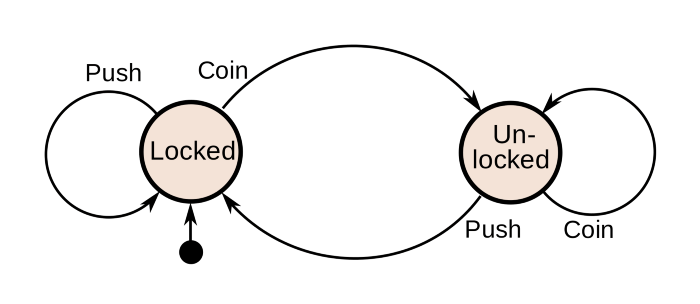

<!-- LOGO -->

  

<!-- BADGES -->

  
  
  
  

# FSM for Go

Finite State Machine for Go

It is heavily inspired from [looplab/fsm](https://github.com/looplab/fsm) library

## License

FSM is licensed under [MIT License](https://opensource.org/licenses/MIT)
